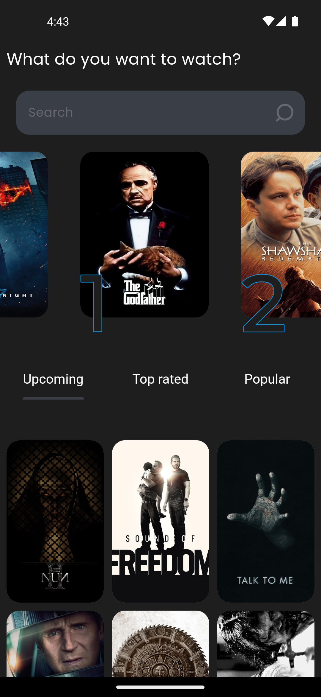
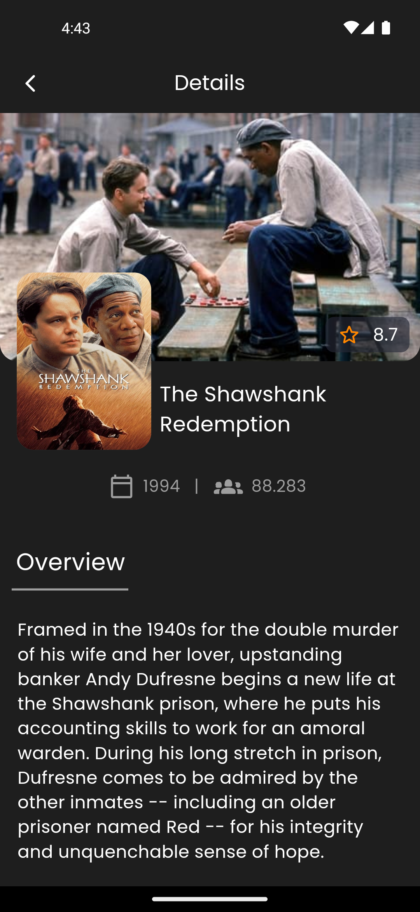
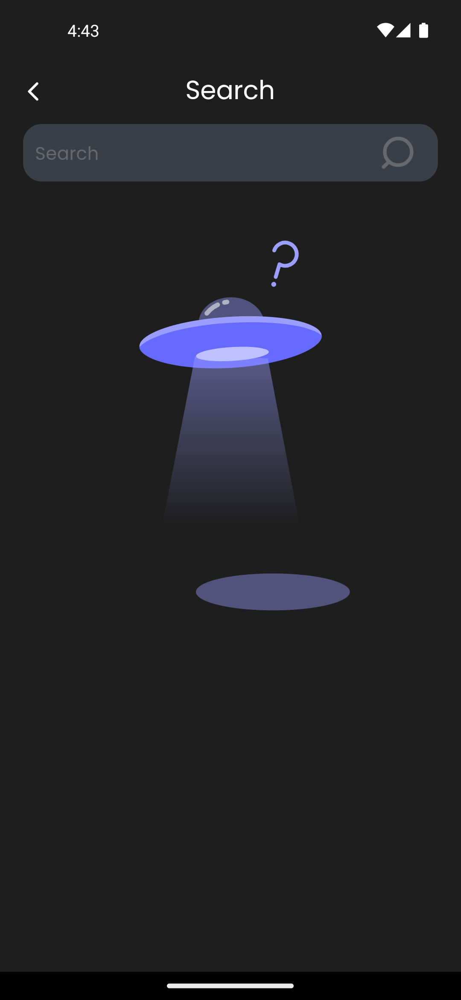
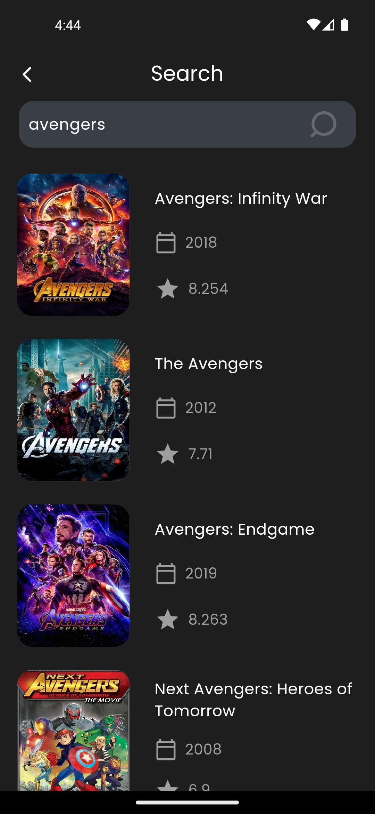
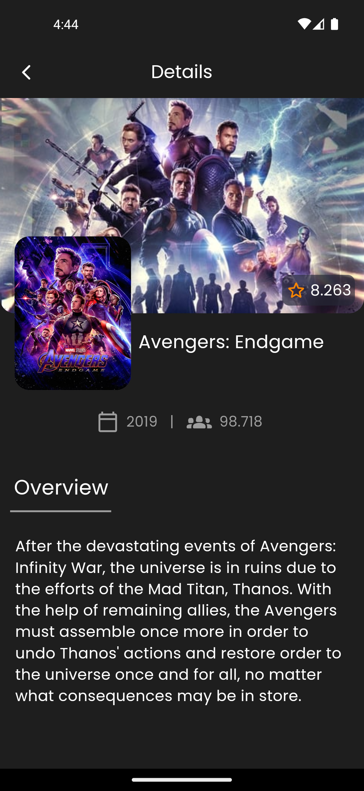

# Movies-App

It is an application for Movie nerds, that can keep them tracked with the top rated, popular and upcoming movies. It has also a search engine powered by TMDP API to make search with any language about any film and show an overview, ratings, date and popularity of this movie.

## API Reference

#### Base API

```http
  GET https://api.themoviedb.org/3/movie/
```


#### Get Movies list

```http
  GET https://api.themoviedb.org/3/movie/${category}

```

| Parameter | Type     | Description                       |
| :-------- | :------- | :-------------------------------- |
| `category`      | `string` | **Required**. which category you need from API |

#### Make a search about a movie

```http
  GET https://api.themoviedb.org/3/search/movie/${query}

```


| Parameter | Type     | Description                       |
| :-------- | :------- | :-------------------------------- |
| `query`      | `string` | **Required**. Name of movie |


## Screenshots

<table border="1" style="solid;">
    <tr>
        <td style="text-align: center;">
            
        </td>
        <td style="text-align: center;">
            
        </td>
    </tr>
    <tr>
        <td style="text-align: center;">
            
        </td>
        <td style="text-align: center;">
            
        </td>
    </tr>
    <tr>
        <td style="text-align: center;">
            
        </td>
    </tr>
</table>
